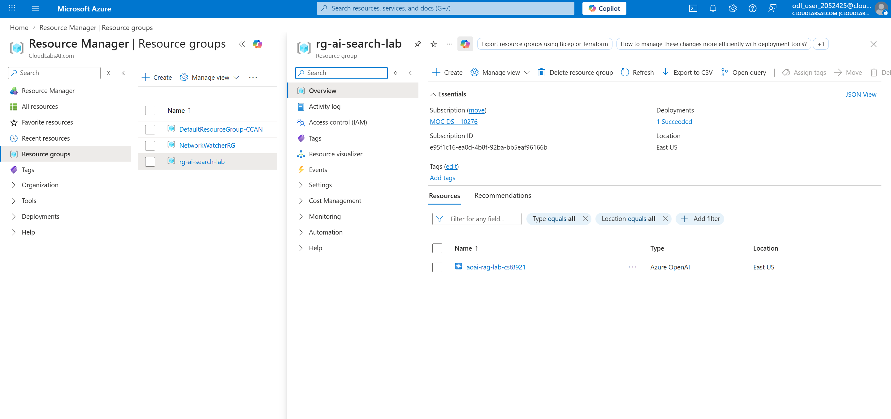
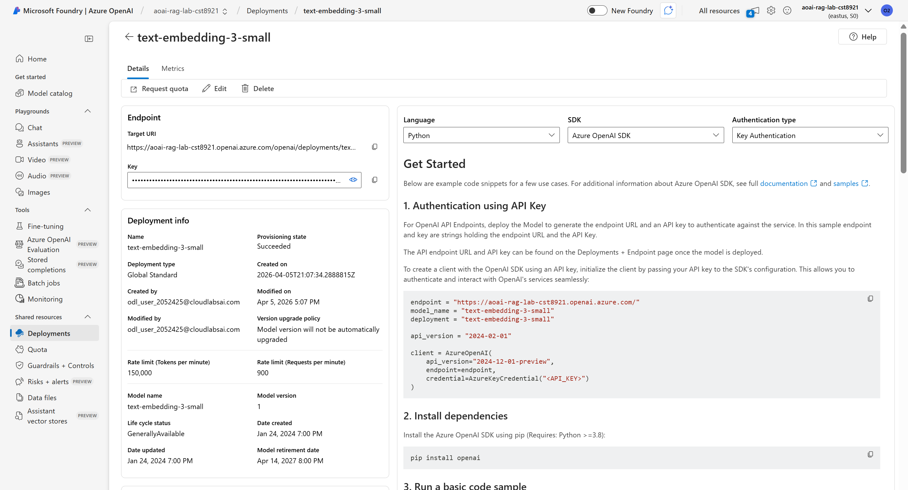
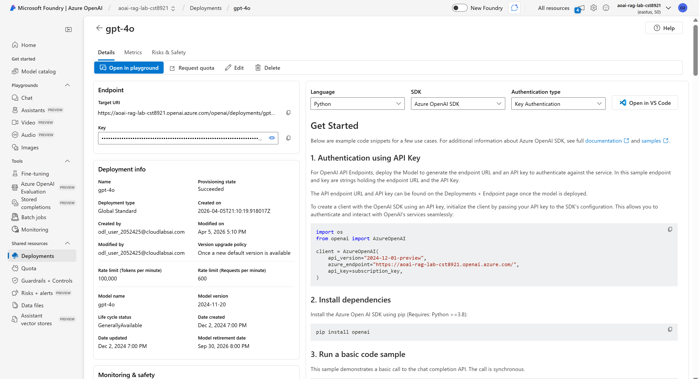
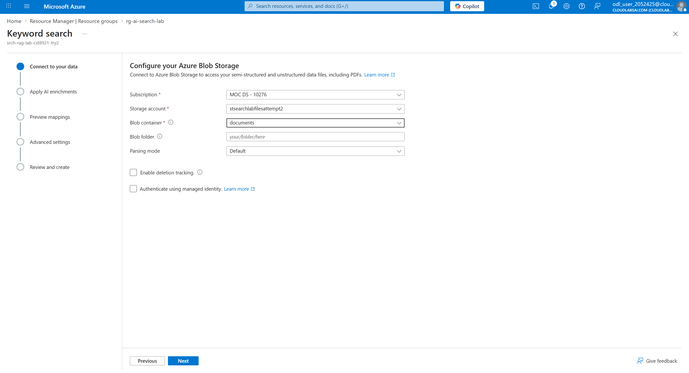
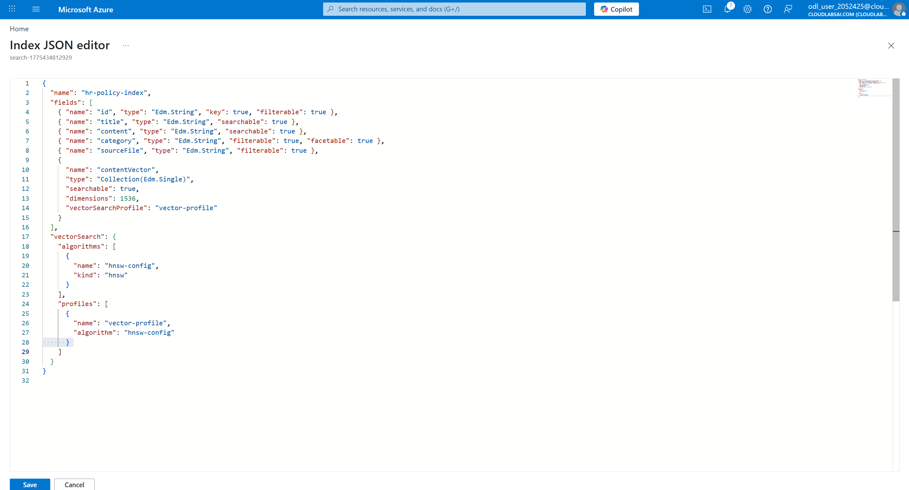

# CST8921 Lab 12

## Set Up Azure AI Search Index and Deploy Embedding & LLM Models

Created RG and Azure OpenAI resources

Selected the appropriate models from Microsoft Foundry

Connected data to search service

Edited JSON for Azure AI Search vector 